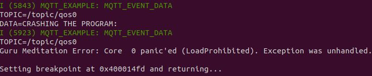
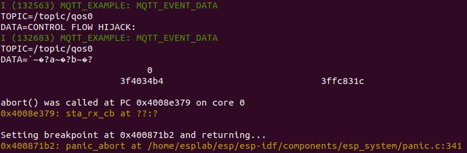

# ESP32 MQTT Format String

## Introduction

TODO

## Crashing the Program

```
. mosquitto_pub.sh crash
```



## Reading the Stack

```
. mosquitto_pub.sh readstack
```


## Reading Arbitrary Memory

```
. mosquitto_pub.sh readmem
```


## Writing Arbitrary Memory

```
. mosquitto_pub.sh writemem
```


## Control Flow Hijack

```
. mosquitto_pub.sh hijack
```


