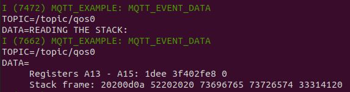
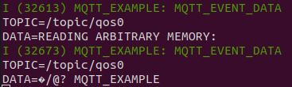
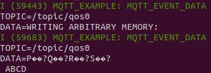

# ESP32 MQTT Format String

## Introduction

TODO

## Get Started on Format String Attack

```
. mosquitto_pub.sh
```

## Reading the Stack



## Reading Arbitrary Memory



## Writing Arbitrary Memory


