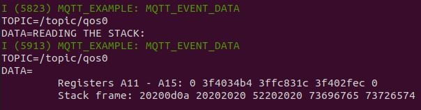

# ESP32 MQTT Format String

## Introduction

TODO

## Crashing the Program

```
. mosquitto_pub.sh crash
```


## Reading the Stack

```
. mosquitto_pub.sh readstack
```



## Reading Arbitrary Memory

```
. mosquitto_pub.sh readmem
```


## Writing Arbitrary Memory

```
. mosquitto_pub.sh writemem
```


## Control Flow Hijack

```
. mosquitto_pub.sh hijack
```

Overwriting the return address:


This new address points to ___abort()___:


Performing the attack:


## Code Injection

```
. mosquitto_pub.sh inject
```

Overwriting the return address:


The injected code is not too interesting when we monitor the output. Instead we show the injected assembly code at the target address:


